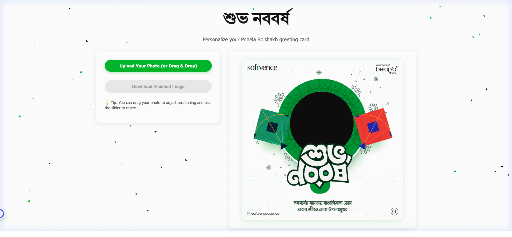

# শুভ নববর্ষ — Pohela Boishakh Card Generator

A modern, responsive Bengali **Noboborsho (Pohela Boishakh)** greeting card generator. Upload your photo, position it inside a decorative festival frame, and download a shareable `.jpg` card — instantly!

🌐 **Live Demo:** [https://novoborsho-softvence.netlify.app](https://novoborsho-softvence.netlify.app)

---

## Screenshot



---

## ✨ Features

- 🎉 **Festive Design** — Softvence-branded colors with animated confetti background
- 📷 **Drag & Drop Upload** — Drop your photo directly onto the canvas or use the file picker
- 🖱️ **Pan & Zoom** — Drag to reposition your photo inside the frame; use the slider to resize
- 🖼️ **Auto Frame Overlay** — `frame.png` loads automatically as soon as the page opens
- 💾 **Download as JPG** — Exports a high-quality, social-media-ready `.jpg` file
- 📱 **Fully Responsive** — Works on desktop, tablet, and mobile

---

## 🛠️ Tech Stack

- **HTML5** — Structure & Canvas API
- **CSS3** — Glassmorphism, animations, responsive grid
- **Vanilla JavaScript** — Zero dependencies, zero frameworks

---

## 🚀 Installation & Local Setup

### Prerequisites
- A modern browser (Chrome, Firefox, Edge, Safari)
- Python 3 **or** Node.js installed (for local server)

### Steps

```bash
# 1. Clone the repository
git clone https://github.com/saidurrahmanmisket/novoborsho.git

# 2. Navigate into the project folder
cd novoborsho

# 3. Start a local server (choose one):

# Option A — Python (built-in, no install needed)
python3 -m http.server 5500

# Option B — Node.js (npx)
npx serve .
```

```
# 4. Open in browser
http://localhost:5500
```

> ⚠️ **Important:** You must use a local server (`http://localhost:...`) — NOT by opening `index.html` directly via `file://`. Opening via `file://` will prevent the image from downloading correctly due to browser security restrictions.

---

## 📖 How to Use

1. Open the app at [https://novoborsho-softvence.netlify.app](https://novoborsho-softvence.netlify.app)
2. Click **Upload Your Photo** or **drag & drop** an image anywhere on the page
3. Use the **slider** to zoom/resize your photo beneath the frame
4. **Click and drag** inside the canvas to reposition your photo
5. Click **Download Finished Image** to save as a `.jpg` file

---

## 📁 Project Structure

```
novoborsho/
├── index.html        # Main HTML structure
├── style.css         # Styles (Softvence theme, animations)
├── script.js         # Canvas logic, upload, pan, zoom, download
├── frame.png         # Festival frame overlay image
├── frame_base64.js   # Base64-encoded frame (enables canvas export)
└── screenshot.png    # App preview screenshot
```

---

## 🌐 Deployment

### Netlify (Live)
[](https://novoborsho-softvence.netlify.app)

Already deployed at: **https://novoborsho-softvence.netlify.app**

To redeploy after changes:
```bash
netlify deploy --dir=. --prod
```

### GitHub Pages (Alternative)
Enable GitHub Pages in repo **Settings → Pages → Branch: main → / (root)**.

---

## 🤝 Credits

Built with ❤️ by [Softvence Agency](https://softvence.agency)
